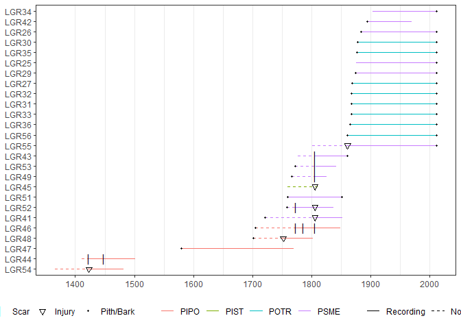

<!-- README.md is generated from README.Rmd. Please edit that file -->

# burnr

<!-- badges: start -->

[](https://cran.r-project.org/package=burnr)
[](https://coveralls.io/github/ltrr-arizona-edu/burnr?branch=master)
[](https://github.com/ltrr-arizona-edu/burnr/actions)
[](https://cran.r-project.org/package=burnr)
[](https://doi.org/10.5281/zenodo.1134832)

<!-- badges: end -->

Basic tools to analyze forest fire history data (e.g. FHX) in R. This is
designed for power users and projects with special needs.

## Installation

You can install the released version of burnr from
[CRAN](https://CRAN.R-project.org) with:

``` r
install.packages("burnr")
```

And the development version from [GitHub](https://github.com/) with:

``` r
# install.packages("devtools")
devtools::install_github("ltrr-arizona-edu/burnr")
```

## Example

This is a basic example which shows you how to solve a common problem:

``` r
library(burnr)

# This gives you a basic plot. There are more advanced options. For example, we can color our plot by sample species.

data(lgr2_meta)

plot(lgr2,
  color_group = lgr2_meta$SpeciesID,
  color_id = lgr2_meta$TreeID,
  plot_legend = TRUE
)
```



## Support

Documentation is included in the code. If you’re new to `burnr`, our
[2018 paper in
Dendrochronologia](https://doi.org/10.1016/j.dendro.2018.02.005) is a
nice survey of the package with many examples. We have also an
[introduction](https://cran.r-project.org/package=burnr/vignettes/introduction.html).
More information can be found on the [project’s
wiki](https://github.com/ltrr-arizona-edu/burnr/wiki). Note, this is
still under construction.

## Citation

Please cite the original `burnr` paper if you use it in your research:

> Malevich, Steven B., Christopher H. Guiterman, and Ellis Q. Margolis
> (2018) [Burnr: Fire History Analysis and Graphics in
> R](https://www.sciencedirect.com/science/article/abs/pii/S1125786517301418?via%3Dihub).
> *Dendrochronologia* 49: 9–15. DOI: 10.1016/j.dendro.2018.02.005.

Citations help us to identify user needs and justify additional time
developing and maintaining `burnr`.

## Development

Please file bugs in the [bug
tracker](https://github.com/ltrr-arizona-edu/burnr/issues).

Want to contribute? Great\! We’re following [Hadley’s packaging
workflow](https://r-pkgs.org/) and [style
guide](https://style.tidyverse.org/). Fork away.

If you’re not a developer, don’t worry\! We also welcome help with
documentation and tutorials.
